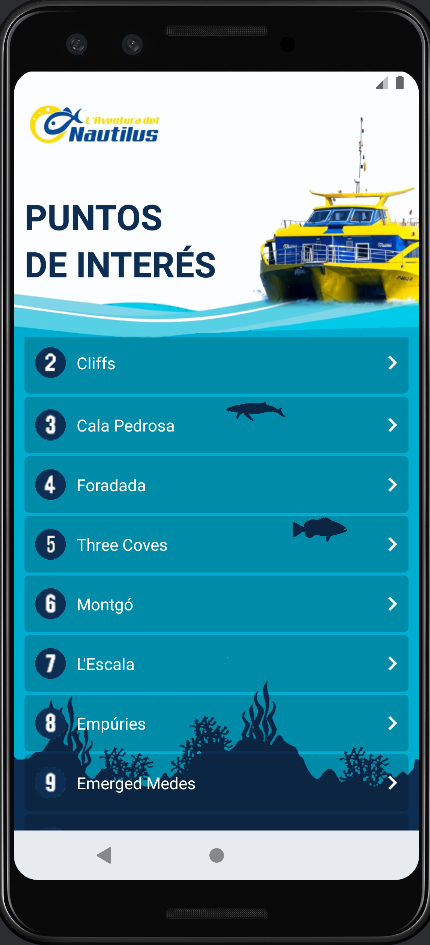

<h1>This is the result of the Android-Kotlin course.</h1>

The project you can see is the final exam of the course where an <a href="https://github.com/ChrisGalHur/kotlin_advanced/raw/main/assets/app-debug.apk" target="_blank">app/copy is made that you can download and test</a>, is made that is as similar as possible to a real application called <a href="https://play.google.com/store/search?q=La%20aventura%20del%20nautilus&c=apps&hl=es" target="_blank">Nautilus</a>.

I have tried to make it look as similar as possible to the original, keeping the shape of the buttons, which in my case I opted for CardView, which is what I wanted to see inside it.

I gave it button movements and delay to maintain the button effect of the original application.

When creating each summary, I decided to make only a second activity, which is simply told which one to show, and from the lists of that activity, the summary that the user wants to see is shown.

In that summary, despite not being specified in the final exercise of the course, the sound area was included. Since I did not have the original sounds, I used a melody that we all surely know to demonstrate that I was able to reproduce sound just as the app that was provided to us did.

Original:

    
    

My version:

  
  

You can <a href="https://github.com/ChrisGalHur/kotlin_advanced/raw/main/assets/app-debug.apk" target="_blank">download the .apk here</a>.
